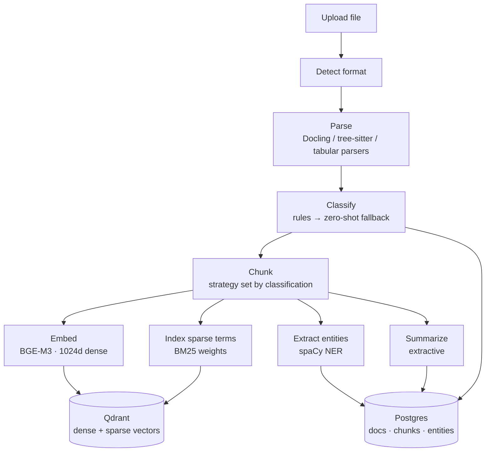
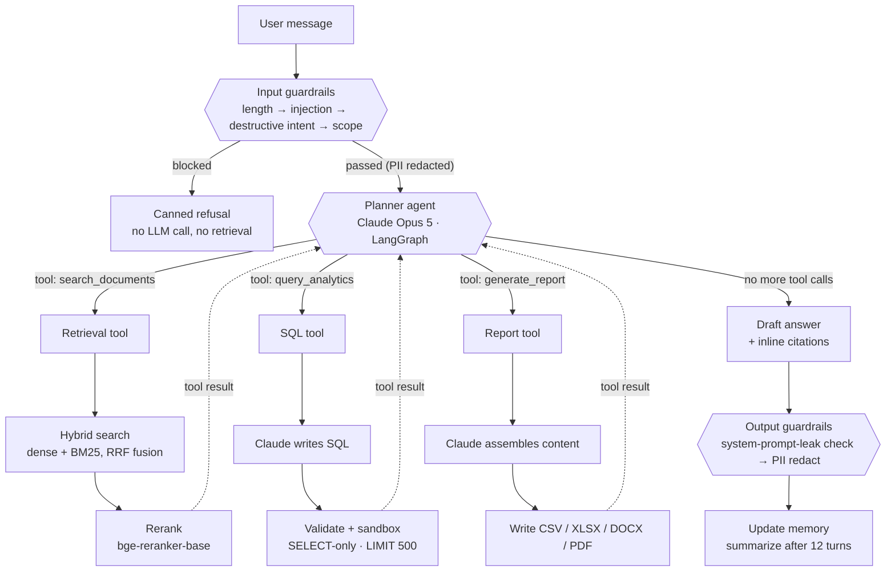

# RAG Platform — Architecture & Flow

This document explains how the system is built and how a request actually moves through it, for anyone who didn't write the code.

**Stack**: FastAPI backend + Streamlit frontend + Qdrant (vectors) + Postgres (everything else) + Claude Opus 5 as the only LLM, orchestrated with LangGraph.

---

## 1. Two pipelines, not one

The system has two independent flows that only meet at the vector store:

1. **Ingestion** (runs once per uploaded document) — a fixed, deterministic pipeline. No LLM involved.
2. **Query time** (runs once per chat message) — an **agentic loop**: one LLM repeatedly decides which tool to call until it's ready to answer.

That split matters for the question "is this RAG, is it agentic, is it multi-model?" — the answer is **all three, at different layers**:

| Question | Answer |
|---|---|
| Is it RAG? | Yes — the `search_documents` tool is classic retrieve → augment → generate. |
| Is it agentic? | Yes — retrieval is a tool the planner LLM *chooses* to call (or not), inside a loop, not a fixed pre-step. |
| Is it multi-model? | Yes — 5 specialist models (embedding, classifier, NER, reranker, LLM) share the work. |
| Is it multi-LLM? | **No** — there is exactly one LLM (Claude Opus 5), reused for planning, SQL writing, report copy, and memory summaries. |

---

## 2. Ingestion pipeline



**Step by step:**

1. **Detect format** — PDF, DOCX, PPTX, HTML, image, Markdown, TXT, XLSX, CSV, JSON, XML, code, SQL.
2. **Parse** — PDF/DOCX/PPTX/HTML/images go through **Docling**; source code through tree-sitter grammars; tabular/structured formats through dedicated parsers.
3. **Classify** — a fast rule-based scorer runs first; if its confidence is below `0.6` it falls back to a zero-shot HF classifier (`deberta-v3-xsmall-zeroshot`). Labels: Research Paper, Company Policy, Manual, SOP, Legal, FAQ, Chat Log, Email, Other.
4. **Chunk** — the strategy depends on the classification: parent/child chunking for Manuals and SOPs, semantic (embedding-similarity) chunking for Research Papers, recursive for Policy/default text, turn-based for chat logs, thread-aware for email. Base chunk size is 400 tokens with 50-token overlap.
5. **Embed** — `BAAI/bge-m3`, 1024-dimensional, normalized.

6. **Sparse index** — BM25 term weights precomputed per chunk (IDF is handled natively by Qdrant at query time).
7. **Entity extraction** — spaCy NER.
8. **Summarize** — extractive summary of each document.
9. **Store** — Postgres gets the document/chunk/entity rows; Qdrant gets the dense + sparse vectors, upserted into a single collection with named vectors (`dense`, `bm25_sparse`).

No LLM call happens anywhere in this pipeline — it's pure ML-model inference plus deterministic logic, so the same document always produces the same result.

---

## 3. Query-time pipeline — the agentic loop



**Why this is "agentic" and not just "RAG with extra steps":** the dotted edges loop back into the planner. Every tool result is handed back to the same LLM, which re-reads the conversation and decides — again — whether to call another tool or answer. This can repeat up to 4 times per turn before the graph forces a stop.

**The three tools:**

| Tool | What runs | LLM involved? |
|---|---|---|
| `search_documents` | Metadata filter (Postgres) → embed query (BGE-M3) → hybrid dense+BM25 search with Qdrant-native RRF fusion → rerank with `bge-reranker-base` cross-encoder → numbered citations | No — deterministic retrieval, this is the actual "RAG" part |
| `query_analytics` | Claude writes read-only SQL against an allow-listed set of metadata tables → validated (`sqlparse`, single `SELECT` only, blocklisted DDL/DML) → wrapped in `LIMIT 500` → always rolled back | Yes — to generate the SQL |
| `generate_report` | Claude assembles the content → written to CSV/XLSX/DOCX/PDF via `openpyxl`/`python-docx`/`reportlab` | Yes — to generate the content |

**Guardrails wrap every turn, not just the LLM call** (`services/guardrails/`, run from `routers/chat.py` before and after the planner, each individually toggleable via `settings.guardrail_*`):

| Stage | Checks, in order | On block |
|---|---|---|
| Input (pre-planner) | length limit → prompt-injection → destructive-intent → scope keywords → PII redaction | Short-circuits — a canned refusal is returned, conversation is still logged, the planner and every downstream tool are skipped entirely |
| Output (post-planner) | system-prompt-leak check → PII redaction | Blocked replies are swapped for a canned refusal; PII redaction always rewrites the text in place, it never blocks |

Every check records a `GuardrailStep` (allow/redact/block + detail) that shows up in the frontend's chat trace, so a blocked or redacted turn is visible, not silent.

**After the loop ends:** the final answer carries bracketed inline citations `[1]` tied to chunk/document IDs, then passes through output guardrails. Conversation memory keeps the last 6 turns verbatim and folds anything older into a running LLM-generated summary once the conversation passes 12 turns.

---

## 4. Where it lives in the code

```
backend/app/services/agents/planner.py       ← LangGraph StateGraph, the loop itself
backend/app/services/agents/retrieval_agent.py ← search_documents tool
backend/app/services/agents/sql_agent.py       ← query_analytics tool
backend/app/services/agents/report_agent.py    ← generate_report tool
backend/app/services/guardrails/pipeline.py    ← run_input_guardrails / run_output_guardrails
backend/app/routers/chat.py                    ← POST /chat: guardrails → compiled graph → guardrails
```

The graph wiring (`planner.py`):

```python
model = ChatAnthropic(...)                     # Claude Opus 5
workflow = StateGraph(AgentState)
workflow.add_node("agent", call_model)         # planner node
workflow.add_node("tools", ToolNode(tools))    # tool-execution node
workflow.add_edge(START, "agent")
workflow.add_conditional_edges("agent", should_continue, {"tools": "tools", END: END})
workflow.add_edge("tools", "agent")            # the loop-back edge
graph = workflow.compile()
```

**The rest of the backend**, `backend/app/services/`, one domain per folder:

| Folder | Purpose |
|---|---|
| `agents/` | The planner loop + its three tools (above) |
| `auth/` | Password hashing/verification (`password.py`), JWT access/refresh tokens (`jwt.py`), the `get_current_user` request dependency (`dependencies.py`), and role-gating via `require_role()` (`rbac.py`) |
| `chunking/` | One strategy module per document type (recursive, semantic, parent/child, header-based, row-based, thread/conversation, function/class-based for code) + a `dispatcher.py` that picks one based on classification |
| `classification/` | Rule-based scorer + zero-shot fallback that tags each document's type |
| `embedding/` | Loads BGE-M3, embeds chunks, writes them to Qdrant |
| `entities/` | spaCy NER extraction + persistence |
| `evaluation/` | Retrieval metrics (recall/precision/MRR/nDCG) + LLM-as-judge answer scoring |
| `generation/` | Builds the prompt and calls Claude for the final answer |
| `guardrails/` | Input/output checks: prompt injection, PII redaction, scope, destructive intent, length, system-prompt-leak |
| `ingestion/` | Format detection + one parser per format (Docling, PyMuPDF, tabular, structured, code, SQL) + storage on disk + `upload_validation.py` (magic-byte sniffing that checks upload content actually matches its extension) |
| `memory/` | Conversation history + per-user preferences |
| `monitoring/` | Latency/retrieval/ingestion metrics, per-document progress tracking |
| `rate_limit/` | Redis-backed fixed-window request limiter (`limiter.py`), applied via a `rate_limit()` FastAPI dependency; fails open if Redis is unreachable |
| `reranking/` | Cross-encoder (`bge-reranker-base`) reranking pass over hybrid search results |
| `retrieval/` | Query embedding, metadata filtering, hybrid dense+BM25 search |
| `sparse/` | BM25 term frequency computation and tokenization |
| `summarization/` | Extractive document summary |

Everything above sits behind `routers/` (one file per resource: `chat`, `documents`, `search`, `conversations`, `reports`, `evaluation`, `admin`, `users`, `terms`, `upload_logs`, `health`) and on top of `models/` (one SQLAlchemy model per Postgres table) and `db/` (Postgres session + Qdrant client setup).

**Frontend**, `frontend/app/`:

| File | Purpose |
|---|---|
| `main.py` | Entry point — sidebar health check, wires `views/*.py` into `st.navigation()` |
| `api_client.py` | Every HTTP call to the backend, wrapped in one `APIError` type |
| `components.py` | Shared UI helpers (error display, debug JSON view, status badges) |
| `views/chat.py` | Chat page — sends messages, renders the agent's tool-call trace |
| `views/documents.py` | Upload, list, and inspect documents (chunks/text/versions/entities/permissions) |
| `views/search.py` | Standalone hybrid search form, no chat |
| `views/reports.py` | Lists and downloads files the chat agent generated |
| `views/admin.py` | Qdrant collection management + metrics |
| `views/evaluation.py` | Create/run eval queries, view eval run results |
| `views/metrics.py` | Per-query retrieval/ingestion stage timing charts |

---

## 5. Key configuration (`backend/app/core/config.py`)

| Setting | Value |
|---|---|
| Embedding model | `BAAI/bge-m3`, 1024d |
| Reranker | `BAAI/bge-reranker-base` |
| Zero-shot classifier | `deberta-v3-xsmall-zeroshot` |
| LLM | `claude-opus-5` |
| Chunk size / overlap | 400 tokens / 50 tokens |
| Chat retrieval top-k | 5 |
| Search top-k cap | 50 |
| Agent max tool iterations | 4 (recursion limit 9) |
| SQL row limit | 500 |
| Memory: recent turns kept / summary trigger | 6 / 12 turns |
| Guardrails enabled | On by default; each check (injection/destructive/scope/PII/leak) individually toggleable |
| JWT access / refresh token lifetime | 30 min / 7 days |
| Rate limit (default / login) | 120 req/60s per client IP / 10 req/60s per client IP |
| Upload MIME check | On by default (`upload_mime_check_enabled`) |

**Auth & RBAC**: `POST /auth/login` and `/auth/refresh` are public; every other route that needs a caller identity reads it via the `get_current_user` dependency (Bearer JWT → Postgres lookup, so a role change or deactivation takes effect on the very next request, not just the next login). `require_role(*roles)` builds on top of that for role-gated routes — currently applied to the `/admin/*` router (Qdrant collection management, metrics) and to user management (`GET /users`, `PATCH /users/{id}`), both admin-only. The core chat/document/search routes remain open in this increment since the frontend doesn't yet carry a bearer token — wiring the Streamlit UI through login is later work.

---

## 6. One-paragraph summary for a non-technical audience

Documents get parsed, tagged by type, split into chunks, and turned into two kinds of index (a meaning-based vector index and a keyword index). When someone asks a question, it first passes a set of safety checks (off-topic, injection, or destructive requests get refused before any AI is involved); if it passes, an AI planner decides for itself whether it needs to search the documents, run a data query, or generate a report file — it can do more than one, in any order, and checks its own results before answering. The reply is screened once more before it's sent back, always carries citations pointing back to the source, and the conversation is remembered by summarizing older turns instead of forgetting them.
