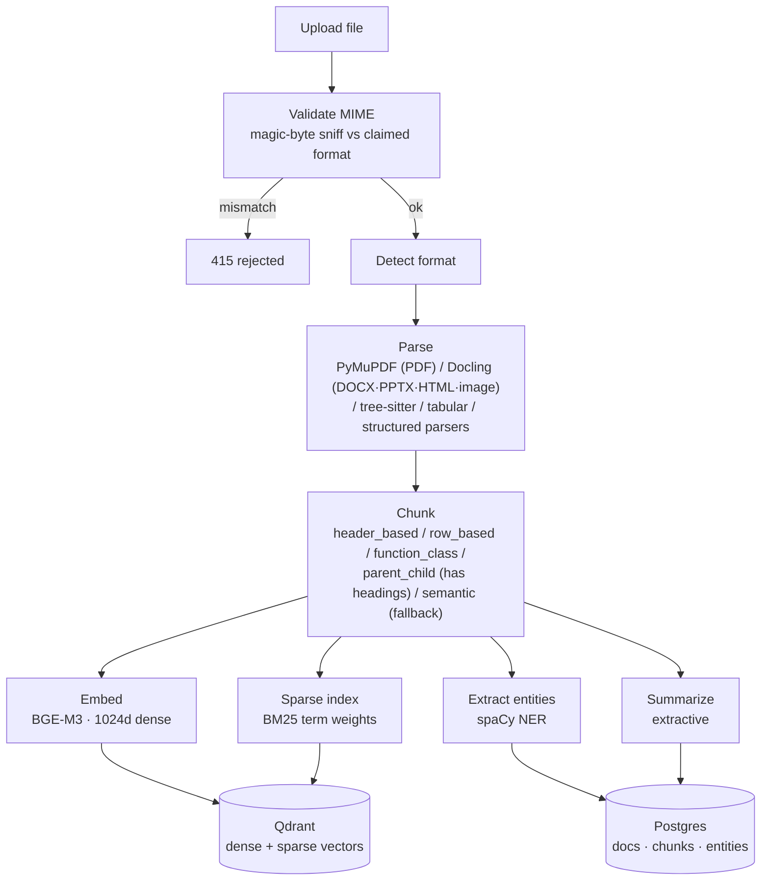
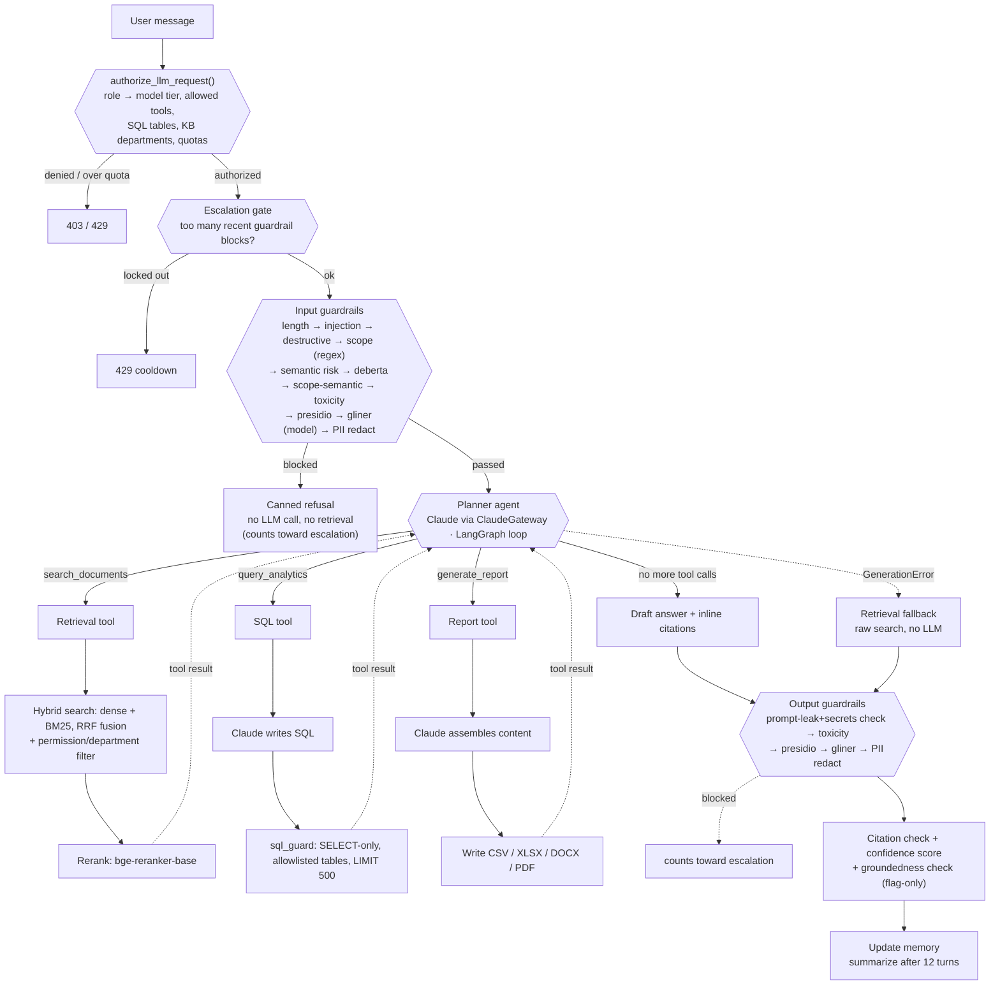

# Project Workflow

How a document and a chat message actually move through the system today. This is a leaner,
process-focused companion to `ARCHITECTURE.md` — see that file for full component detail.

---

## 1. Ingestion workflow (runs once per uploaded document)

**Steps, in order:**

1. **Validate** — `upload_validation.py` sniffs the file's actual bytes against its claimed
   extension; a mismatch is rejected before anything else runs (toggle:
   `settings.upload_mime_check_enabled`).
2. **Detect format** — PDF, DOCX, PPTX, HTML, image, Markdown, TXT, XLSX, CSV, JSON, XML, code, SQL.
3. **Parse** — PDF now goes through **PyMuPDF** directly (with font-size-heuristic heading
   reconstruction), not Docling — that path was disabled for speed. Docling still handles
   DOCX/PPTX/HTML/images; source code goes through tree-sitter grammars; tabular/structured
   formats use dedicated parsers.
4. **Chunk** — strategy is picked by format first, then document structure: `header_based`
   (HTML/Markdown), `row_based` (XLSX/CSV/SQL), `function_class` (code, language-aware), and for
   everything else `parent_child` if the parsed doc has headings, else `semantic`
   (embedding-similarity). Base chunk size 400 tokens / 50-token overlap.
   *There is no document-type classification step anymore* — it was a zero-shot model call and
   was removed for latency; the `classification`/`classification_confidence` columns still exist
   but nothing populates them.
5. **Embed** — `BAAI/bge-m3`, 1024-dimensional, normalized.
6. **Sparse index** — BM25 term weights precomputed per chunk.
7. **Entity extraction** — spaCy NER.
8. **Summarize** — extractive summary of the document.
9. **Store** — Postgres gets document/chunk/entity rows; Qdrant gets dense + sparse vectors in
   one collection with named vectors (`dense`, `bm25_sparse`).

No LLM call happens anywhere in ingestion — deterministic, same input always produces the same output.

---

## 2. Query workflow (runs once per chat message)

**Steps, in order:**

1. **LLM RBAC gate** (`llm_rbac/engine.py::authorize_llm_request()`, runs first, before
   guardrails) — reads the caller's role (`core/roles.py`) against `config/llm_rbac.yaml` and
   decides: which Claude tier they may use (e.g. Employee is locked to `sonnet`; HR/PM/Admin can
   escalate to `opus` for named actions), which of the three planner tools they may call, which
   SQL tables `query_analytics` may touch, which knowledge-base departments they may retrieve
   from, and enforces per-role rate/quota limits (requests-per-minute, daily/monthly token & cost
   budgets, max concurrent requests). A denial or over-quota call short-circuits before any LLM
   or retrieval work happens.
2. **Escalation gate** (`guardrails/escalation.py::check_escalation()`, runs right after the RBAC
   gate, before conversation lookup or any guardrail check) — a user who has accumulated enough
   guardrail blocks (input or output, any check) within a rolling window is locked out for a
   cooldown period. Distinct from RBAC's request-volume rate limiting: this tracks *block*
   frequency, not request count.
3. **Input guardrails** (`guardrails/pipeline.py`, each check individually toggleable, cheap
   regex/keyword checks first so a block never pays for model inference) — length limit →
   prompt-injection → destructive-intent → scope keywords (regex) → semantic risk (embedding) →
   DeBERTa injection classifier → scope via embedding similarity → toxicity classifier → Presidio
   PII → GLiNER PII (model-based) → PII redaction. A block short-circuits with a canned refusal;
   the turn is still logged and counts toward the escalation gate above.
4. **Planner loop** (`agents/planner.py`, LangGraph `StateGraph`) — gets a role-tier-bound,
   tool-bound Claude model from `gateway/claude_gateway.py::get_langchain_model()` and loops
   `agent ↔ tools` until it stops requesting tools or hits the iteration cap (4 tool calls,
   recursion limit 9). Every tool result is fed back to the same model, which re-decides whether
   to call another tool or answer.
5. **Tools available to the planner** (each individually gatable by LLM RBAC):
   - `search_documents` → deterministic hybrid retrieval: metadata filter → embed query (BGE-M3)
     → dense+BM25 search with Qdrant-native RRF fusion → permission/department filter → rerank
     (`bge-reranker-base`) → numbered citations. No LLM involved — this is the actual "RAG" step.
   - `query_analytics` → Claude writes read-only SQL against an allowlisted metadata-table set →
     validated by `guardrails/deterministic/sql_guard.py` (single `SELECT` only, DDL/DML
     blocklisted) → wrapped in `LIMIT 500`.
   - `generate_report` → Claude assembles content → written to CSV/XLSX/DOCX/PDF via
     `openpyxl`/`python-docx`/`reportlab`.
6. **Fallback** — if the gateway call raises `GenerationError` (model/provider failure), the
   router falls back to `run_retrieval_fallback()` — a raw, non-LLM search response — rather than
   failing the request outright.
7. **Output guardrails** — system-prompt-leak check (now also a generic secrets scan: GitHub/
   Slack/Google/Stripe token shapes, PEM key blocks) → toxicity classifier → Presidio PII → GLiNER
   PII → PII redaction (redaction rewrites in place, never blocks). A block counts toward the
   escalation gate, same as an input block.
8. **Citation + groundedness + confidence score** (`guardrails/citation_rail.py`,
   `guardrails/groundedness_check.py`) — citation check flags whether the answer actually carries
   citations; groundedness runs an NLI model to flag whether the reply contradicts its retrieved
   sources; confidence score is relevance-based. All three run alongside output guardrails, not
   inside the same pipeline call, and none of them block — they're trace/UI signals only.
9. **Memory update** — last 6 turns kept verbatim; once a conversation passes 12 turns, older
   turns are folded into a running LLM-generated summary.

Every guardrail/RBAC/citation step is recorded as a `GuardrailStep` (allow/redact/block + detail)
and surfaced in the frontend's chat trace, so a blocked, redacted, or fallback turn is visible,
not silent.

---

## 3. Where each stage lives

| Stage | Code |
|---|---|
| Upload validation | `backend/app/services/ingestion/upload_validation.py` |
| Parsing | `backend/app/services/ingestion/{pymupdf_parser,docling_parser,...}.py`, `dispatcher.py` |
| Chunking | `backend/app/services/chunking/dispatcher.py` + one module per strategy |
| Embedding / sparse index | `backend/app/services/embedding/`, `backend/app/services/sparse/` |
| LLM RBAC gate | `backend/app/services/llm_rbac/engine.py`, `policy_loader.py`, `quotas.py`; policy in `backend/config/llm_rbac.yaml` |
| Guardrails | `backend/app/services/guardrails/pipeline.py` + one module per check |
| Planner loop | `backend/app/services/agents/planner.py` |
| Tools | `backend/app/services/agents/{retrieval_agent,sql_agent,report_agent}.py` |
| Claude access (model routing, retry, cache) | `backend/app/gateway/` (`claude_gateway.py`, `model_router.py`, `retry_handler.py`, `cache_manager.py`, `usage_tracker.py`) |
| Chat endpoint wiring | `backend/app/routers/chat.py` (RBAC gate → input guardrails → planner/fallback → output guardrails → citation check → memory) |
| Auth | `backend/app/services/auth/` (JWT), `backend/app/routers/auth.py` (`/auth/login`, `/auth/refresh`, `/auth/me`) |
| Rate limiting | `backend/app/services/rate_limit/limiter.py` (Redis fixed-window, applied to login and per-role via LLM RBAC) |
| Self-service usage/capabilities | `GET /users/me/usage` (quota limits + day/month usage), `GET /users/me/capabilities` (model tier, tools, named capabilities) — both in `backend/app/routers/users.py`, read straight from `policy_loader.role_config()` so they can't drift from what LLM RBAC actually enforces |
| Frontend pages | `frontend/app/views/{login,dashboard,chat,documents,search,reports,admin,evaluation,metrics}.py`, wired by `frontend/app/main.py` via `st.navigation()`; shared header/nav/table styling in `frontend/app/components.py` |

---

## 4. Auth & quota notes

- JWT access tokens last 30 min, refresh tokens 7 days (`core/config.py`). `get_current_user`
  re-reads the role from Postgres on every request, so a role change or deactivation takes effect
  immediately, not just on next login.
- Login is rate-limited (10 req/60s per client IP); everything else defaults to 120 req/60s.
- Both the rate limiter and the LLM RBAC concurrency slot fail **open** (allow the request) if
  Redis is unreachable — they degrade availability-first, not safety-first.
- `views/dashboard.py` calls both `GET /users/me/usage` and `GET /users/me/capabilities` on every
  load; `views/chat.py`'s sidebar expander calls just the latter. Both render via
  `components.py::render_capabilities()`, so a logged-in user always sees their *actual*
  current-day/month quota usage and role capabilities — not a static description that can drift
  from `config/llm_rbac.yaml`.

---

## 5. Frontend nav-level role restrictions

`frontend/app/main.py` builds a different `st.navigation()` page set per role — **UI visibility
only, never authorization**; every page still calls backend endpoints that independently enforce
the real rules via LLM RBAC. Today that means:

- **Employee** (`role="user"`) gets Dashboard, Chat, and Documents only — Search and Reports are
  hidden from nav (`_is_employee` in `main.py`; mirrored in `views/dashboard.py`'s quick actions so
  it never links to a page that isn't registered).
- **Employee and HR** don't get the Documents page's Upload tab or Delete button
  (`_can_manage_documents` in `views/documents.py`) — matches `upload_documents`/
  `delete_documents` both being denied for both roles in `config/llm_rbac.yaml`. Project Manager
  and Admin keep both.
- **Admin only** gets the Operations group (Admin / Evaluation / Query Metrics pages).

---

## 6. Demo data

`backend/scripts/seed_users.py` seeds a large batch of login-ready accounts across all four roles
directly into Postgres (bypassing `POST /users`, which can only create Employee accounts) — short
`empN`/`hrN`/`pmN`/`ceoN`@mail.com emails, one shared password, idempotent per role. Run it from
`backend/` with `python -m scripts.seed_users`; it writes `scripts/seeded_users.{csv,xlsx}` as a
login-credential reference (both gitignored). Document/chunk/conversation data is intentionally out
of scope for this script — it seeds users only.
