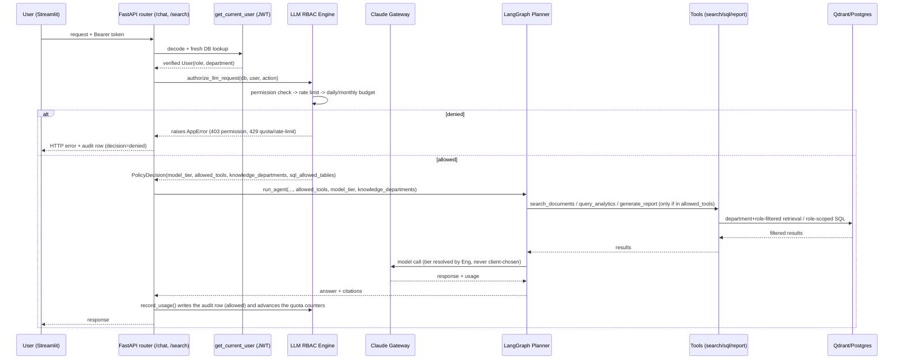

# LLM RBAC — Architecture

Scope note: this implements the ATHENA MES AI LLM RBAC request against what actually exists in this
repo today — see `docs/LLM_GATEWAY_ANALYSIS.md`, `docs/CLAUDE_GATEWAY_ARCHITECTURE.md`,
`docs/AGENT_SECURITY_MODEL.md`, and `docs/GUARDRAILS_ARCHITECTURE.md` for the prior increment this
builds on (the Claude Gateway, JWT auth, `Role`/`require_role()`, retrieval-permission filtering).
This document covers what's new: the role/department policy layer that governs every request those
pieces already carry.

## 1. Why

Before this change, `/chat` and `/search` were not auth-gated at all — `user_id` was an optional,
client-supplied, unverified field used only for an opt-in per-user document permission filter.
Nothing constrained which Claude model tier a request used, how many requests a role could make, or
what a role's agent turn was allowed to retrieve or execute. Every one of the prior increment's design
docs flagged closing this as the prerequisite for role-based control to be a real security boundary —
this increment closes it and adds the governance layer on top.

## 2. Request flow

Every arrow into "Claude Gateway" already existed
(`backend/app/gateway/claude_gateway.py` — the only code in this repo that talks to Anthropic). This
increment adds the **LLM RBAC Engine** box and makes `/chat` and `/search` go through it before the
planner/gateway ever run — no second path to Claude was introduced.

## 3. Components

| Component | File | Responsibility |
|---|---|---|
| Policy config | `backend/config/llm_rbac.yaml` | Single source of truth: per-role model tiers, knowledge departments, tools, named permissions, quotas. Configurable without a code change; `enabled: false` is a full kill switch. |
| Policy loader | `services/llm_rbac/policy_loader.py` | Parses the YAML into typed `RoleConfig` objects, cached. Falls back to a conservative built-in default (tools/tiers/quotas only — see its module docstring) if the file is missing, so a packaging bug fails safe rather than silently disabling governance. |
| Policy engine | `services/llm_rbac/engine.py` | `authorize_llm_request(db, user, endpoint, action=None)` — the single entrypoint. Runs permission → rate-limit → budget checks in order, raises `AppError` on the first failure, returns a `PolicyDecision` on success. |
| Quotas | `services/llm_rbac/quotas.py` | Daily/monthly token & cost budget checks against `RoleUsageCounterModel`, plus a Redis-backed per-user concurrency guard. |
| Tools | `services/llm_rbac/tools.py` | `allowed_tools_for(role)` — which of the 3 planner tools a role's agent turn may call. |
| Category policy | `services/guardrails/retrieval_permissions.py::apply_category_policy()` | New function alongside the existing `apply_permission_policy()` — department/role-based document filtering, wired into `retrieval/metadata_filter.py::resolve_document_ids()` immediately before the existing per-user permission filter. |
| Audit log | `models/gateway_usage_log.py` (`GatewayUsageLogModel`) | Extended with `user_id`/`role`/`department`/`decision`/`tool_calls`/`documents_retrieved`/`prompt_version`/`requested_capability` — see `docs/AUDIT_LOGGING.md`. |
| Document router auth | `routers/documents.py` | Every route requires `get_current_user`; upload/delete gated via `authorize_llm_request(action=...)`; reads reuse `apply_category_policy()`. See `docs/TOOL_AUTHORIZATION.md` §4. |
| Report RBAC | `models/report.py`, `routers/reports.py` | `owner_id`/`department` tag each report at generation time; list/download filtered to reports the caller owns or can see by department. See `docs/LLM_RBAC_POLICY.md`. |
| Report-type policy | `services/llm_rbac/report_policy.py` | `authorize_report(user, report_type)` — a sibling to `authorize_llm_request()`, not a replacement: answers "may this role generate *this* report type, and what's it scoped to." New `reports:` block per role in `llm_rbac.yaml`. See `docs/REPORT_AUTHORIZATION.md`. |
| Project governance | `models/project.py`, `project_member.py`, `approval_request.py`; `services/projects/`; `routers/projects.py`, `approvals.py` | Greenfield: `ProjectModel` lifecycle + `ApprovalRequestModel` (also reused for document-delete approval). No LLM ever mutates project state — see `docs/PROJECT_GOVERNANCE.md`. |
| Project data tool | `services/agents/project_agent.py::list_my_projects()` | Read-only, Python/ORM-filtered planner tool (`manager_id`/membership) — deliberately not exposed via `query_analytics`, so no Claude-authored SQL ever reaches `projects`/`project_members`. See `docs/PROJECT_GOVERNANCE.md` §6. |

## 4. Role taxonomy

`core/roles.py::Role` was extended, not replaced: `ADMIN` (CEO/Admin) and `USER` (Employee) keep
their existing string values so no existing data/API contract breaks; `HR` and `PROJECT_MANAGER` were
added. The 11 manufacturing-domain role values already in the enum (`plant_manager`,
`maintenance_engineer`, etc.) are untouched and remain inert — they belong to a separate future
initiative, not this one. `Role` and `Department` are independent axes: a nullable `department` column
was added to both `User` and `Document`, because the spec treats them as distinct governance inputs.

## 5. What this does not build

Several permissions in the original spec name a capability with no underlying data model in this
repo — HR's "workforce planning"/"attendance analytics", Employee's "machine status queries", CEO's
"production"/"maintenance"/"quality"/"inventory" reports. There is no employee/attendance/machine/
production table in this schema (confirmed in `docs/LLM_GATEWAY_ANALYSIS.md` §0 — the schema is
entirely document-RAG domain, now plus a real project-governance domain — see §3 above). Those
permissions/report types are enforced correctly (the policy check passes or fails exactly as
configured) but generating one returns an honest "no data source" response rather than a fabricated
report — see `docs/REPORT_AUTHORIZATION.md` §3. This mirrors how the 11 manufacturing `Role` values
already sit inert in this codebase; see `docs/ROLE_PERMISSION_MATRIX.md` and
`docs/USER_WISE_REPORT_RBAC.md` for the full wired-vs-inert breakdown per action/report type.

`project_creation`/`project_allocation` — inert in the prior pass for lack of a `projects` table — are
**no longer inert**: `docs/PROJECT_GOVERNANCE.md` covers the now-real project-governance domain built
in this pass.

Also not built: NeMo Guardrails, MCP tool-execution rails, Langfuse/OpenTelemetry — out of scope per
`docs/LLM_GATEWAY_ANALYSIS.md` §5, and nothing in the LLM-RBAC request needs them.

## 6. Extension points

- ~~**Admin UX for `department`/document categorization**~~ — **closed.** `POST /documents/upload`
  now accepts optional `department`/`project`/`security_classification` form fields, defaulting
  `department` to the uploader's resolved department when omitted, and always sets `owner_id`. See
  `docs/KNOWLEDGE_ACCESS_CONTROL.md` §5.
- ~~**`routers/documents.py` has no LLM RBAC gate**~~ — **closed.** Every route in that router now
  requires `get_current_user`; upload/delete are gated through `authorize_llm_request()` (same
  function chat/search use); the read routes (`GET /documents`, `.../text`, `.../chunks`) reuse
  `apply_category_policy()` so the direct browse API can no longer bypass the department filtering
  chat/search already enforced. See `docs/TOOL_AUTHORIZATION.md` §4.
- ~~**Reports have no access control**~~ — **closed.** `ReportModel` gained `owner_id`/`department`;
  `generate_report()` tags both at creation time; `routers/reports.py` now requires
  `get_current_user` and filters list/download to reports the caller owns or whose department is in
  their `knowledge_departments`. See `docs/LLM_RBAC_POLICY.md` §1's Report row.
- **Document intent-based escalation**: tier escalation is action-based (a caller-supplied `action`
  field matching `llm_rbac.yaml`'s permission catalog), not a free-text complexity classifier — see
  `docs/CLAUDE_GATEWAY_MODEL_ROUTING.md` for why. A smarter router (NLP intent classification) could
  replace this without changing `engine.py`'s public interface.
- **Approval workflow**: `llm_rbac.yaml`'s `approval_required_actions` and `PolicyDecision.requires_approval`
  now have one real consumer — `routers/documents.py::delete_document()` blocks with
  `403 approval_required` rather than allowing — but there's still no `ApprovalRequest` model or
  grant mechanism. Deliberately minimal, since building a fake approval-grant flow wasn't in scope
  (see `docs/LLM_RBAC_POLICY.md` §4).
- **Sub-routes left at login-only**: `routers/documents.py`'s `progress`/`versions`/`entities`/
  `permissions` grant-list-revoke/`reindex` routes now require authentication but don't yet have a
  fine-grained RBAC action of their own — noted as remaining scope in
  `docs/LLM_RBAC_IMPLEMENTATION_REPORT.md` rather than expanded further in this pass.
