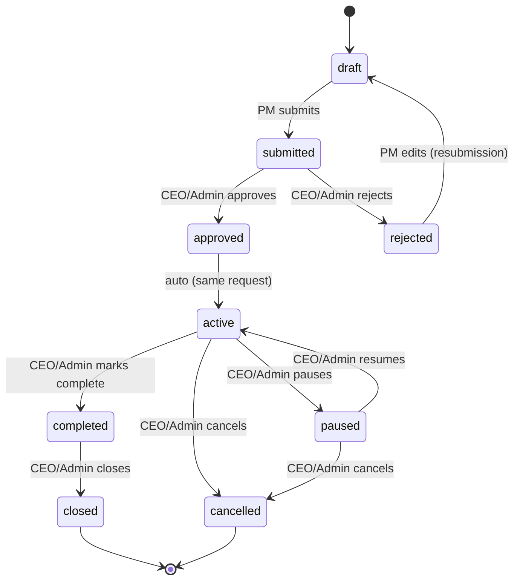

# Project Governance

Greenfield in this pass — before it, no `Project`/`ApprovalRequest` domain model existed anywhere in
this repo (confirmed by grep: `project_creation`/`project_allocation` were inert `llm_rbac.yaml`
permission-catalog strings with no table behind them, and `DocumentModel.project` was — and still
is — an unrelated free-text string field). This document covers what was built.

## 1. Models

`backend/app/models/project.py::ProjectModel` — `id`, `name`, `description`, `department`,
`manager_id` (FK `users.id`, `SET NULL`), `created_by`, `priority` (`low|medium|high|critical`),
`status` (see §2), `created_at`/`updated_at`/`closed_at`. Kept as plain strings, not a DB enum type —
`services/projects/lifecycle.py` is the single place `status` is interpreted as a state machine, so a
new status value never needs a migration.

`backend/app/models/project_member.py::ProjectMemberModel` — `project_id`/`user_id` (both `CASCADE`),
`role_on_project` (free text), `assigned_at`. Unique on `(project_id, user_id)`.

`backend/app/models/approval_request.py::ApprovalRequestModel` — generic, not project-specific:
`action`, `target_type` (`project`|`document`), `target_id`, `requested_by`, `role`, `payload`
(JSONB, currently unused — reserved for a future action that needs to propose specific new values),
`status` (`pending|approved|rejected`), `decided_by`, `decided_at`, `reason`, `created_at`. Reused for
document deletion too — see §4.

## 2. Lifecycle



`services/projects/lifecycle.py::VALID_TRANSITIONS` is the single source of truth (exhaustively unit
tested — every declared transition succeeds, every undeclared one 409s — in
`tests/projects/test_lifecycle.py`). Two things worth calling out that aren't obvious from the spec's
own diagram:

- **`approved → active` is automatic**, applied in the same `decide_approval()` call that sets
  `approved` — there's no separate "activate" step a human has to remember to click.
- **`rejected → draft`, not a dedicated "resubmit" transition.** The spec's diagram shows
  `submitted → rejected` as a dead end with no way back. In practice that would make a rejected
  project permanently stuck, so editing a rejected project (`PATCH /projects/{id}`) silently moves it
  back to `draft` first (see `services/projects/service.py::update_project()`), and the PM resubmits
  through the normal `draft → submitted` path. This is a deliberate, documented addition beyond the
  literal spec diagram, not an oversight.
- **`complete` isn't a named action in spec §5's CEO capability list**, but the lifecycle diagram in
  spec §14 requires an `active → completed` step before `close()` will accept a project (`close()`
  explicitly rejects anything that isn't already `completed` — see `service.py::close()`). Exposed as
  `POST /projects/{id}/complete`, CEO/Admin-only, same as every other direct transition.

## 3. Who can do what — and why §4/§15 don't actually contradict each other

Spec §4 says a Project Manager **cannot** close, cancel, or change the project manager. Spec §15
lists "Pause Project, Close Project, Cancel Project, Change Project Priority, Change Project Manager,
Major Resource Reallocation" as **requiring CEO/Admin approval** — which reads, on a first pass, like
PM can request them and CEO approves. That can't be right given §4's explicit "cannot," and building
an approval path for an action a role can never even attempt would just be dead code. The resolution
implemented here: those seven actions are **CEO/Admin-only direct actions** (`require_role(Role.ADMIN)`
on every one of `routers/projects.py`'s `/reallocate`, `/priority`, `/manager`, `/pause`, `/resume`,
`/close`, `/cancel` routes — a Project Manager gets a 403 before the handler body ever runs, not a
queued approval request). No approval step is needed for them because CEO/Admin is already the final
authority — an approval workflow only makes sense when the *requester* and *approver* are different
people, and PM has no path to request any of these at all.

**The one real approval trigger** is `POST /projects/{id}/submit` (PM only, `draft`/`rejected` →
`submitted`) — this is what spec §15's "Create Project ... requires approval" actually maps to: a PM
can freely create and edit a `draft` (that's normal CRUD, not gated), but a project only becomes
`active` — actually live — once a CEO/Admin explicitly approves the submission via
`POST /approvals/{id}/decide`. `submit_for_approval()` (`services/projects/service.py`) creates the
`ApprovalRequestModel` row; `decide_approval()` (`routers/approvals.py`) is the only place that row
is ever acted on.

| Role | `POST /projects` | `PATCH` (own draft) | `/members` (own) | `/submit` (own) | `/reallocate` `/priority` `/manager` `/pause` `/resume` `/complete` `/close` `/cancel` |
|---|---|---|---|---|---|
| Employee | 403 | 403 | 403 | 403 | 403 |
| HR | 403 | 403 | 403 | 403 | 403 |
| Project Manager | own only (`manager_id` forced to self) | ✅ | ✅ | ✅ | 403 (all eight) |
| CEO/Admin | any manager | any project | any project | — (PM's action, not needed) | ✅ (all eight) |

## 4. Reused for document deletion too

Before this pass, `routers/documents.py::delete_document()` hard-blocked a Project Manager's delete
request with `403 approval_required` and an explicit comment that no approval workflow existed to
honor it (`docs/LLM_RBAC_POLICY.md` §4, prior pass). Now that `ApprovalRequestModel` exists, that
block is upgraded to a real queue entry:

```python
if decision.requires_approval:
    approval = ApprovalRequestModel(action="delete_document", target_type="document", target_id=document_id, ...)
    db.add(approval); db.commit()
    return JSONResponse(status_code=202, content={"approval_request_id": str(approval.id), "status": "pending"})
```

`routers/approvals.py::decide_approval()` dispatches on `target_type`: `"project"` goes to
`services/projects/service.py::apply_decision()`; `"document"` calls
`routers/documents.py::delete_document_row()` (the actual deletion logic, factored out of
`delete_document()` so both the immediate-delete path and the deferred-approval path share one
implementation, not two).

## 5. Claude never touches project state directly

Every mutation — `create_project`, `update_project`, `add_members`, `submit_for_approval`,
`apply_decision`, and every CEO/Admin direct transition — lives in
`services/projects/service.py`/`lifecycle.py`, called only from `routers/projects.py` and
`routers/approvals.py`. The planner's only project-related tool,
`services/agents/project_agent.py::list_my_projects()`, is **read-only** — a plain SQLAlchemy query,
never a write, and it's a completely separate module `service.py` doesn't import and vice versa. This
mirrors the spec's explicit "Do not allow Claude to directly change project state" and "the AI may
recommend or prepare the action, must not silently execute high-risk operations" — there is
structurally no tool a planner turn could call to mutate a project even if the model attempted it.

## 6. Why row-level project scoping doesn't go through `query_analytics`

`sql_guard.py` only does table-level allowlisting — no `WHERE`-clause injection into Claude-authored
SQL. Rather than extend a security-critical SQL parser to safely rewrite an arbitrary Claude-authored
query with a `manager_id = :user_id` predicate (a genuinely delicate change with real bypass risk),
`projects`/`project_members` are **not** added to any role's `sql_allowed_tables` at all —
`query_analytics` can't see them, full stop. Project data reaches the planner exclusively through
`list_my_projects()`'s Python-side `.filter(manager_id == user_id)` — see
`docs/REPORT_AUTHORIZATION.md` §3 for the full reasoning and how this compares to the document/report
scoping mechanisms that already existed.
